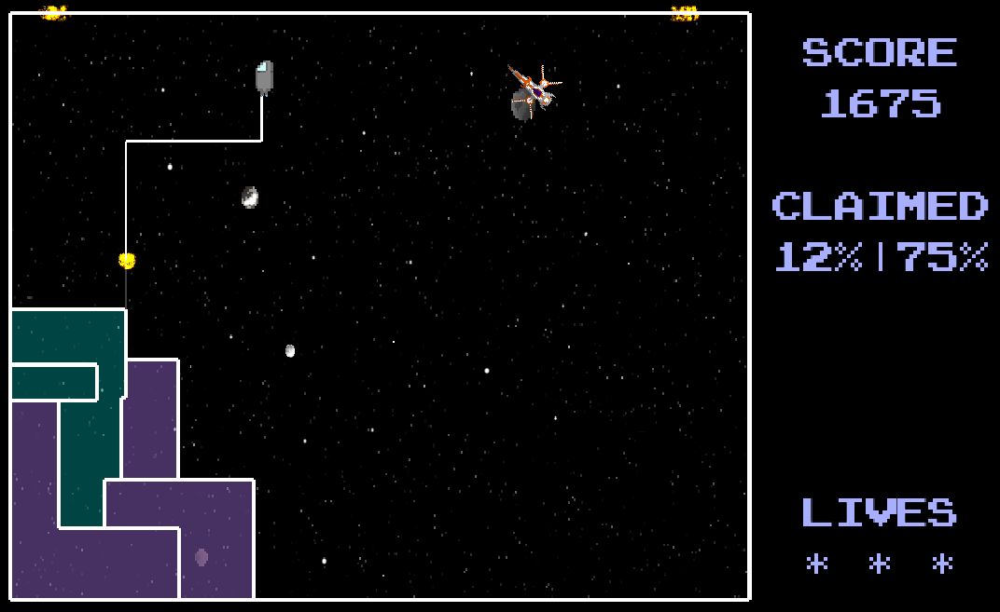

# Qixxy

**Qixxy** is a Qix-clone game for PC. You can read more about Qix [here](https://en.wikipedia.org/wiki/Qix).

The goal is to fence off a supermajority of the playfield while trying to stay alive and gain as much points as you can.

This project is licensed under [the MIT License](./LICENSE).

## Disclaimer

The app was written as a university project in 2016 as a way to learn some Scala and game development. I don't update or maintain it.

## Building

You should have Java 6+ on your computer.

1.  `git clone https://github.com/oeshiro/qixxy.git`
2.  `cd qixxy`
3.  Build it with Gradle: `./gradlew desktop:dist`
4.  The `.jar` file should be generated under `desktop/build/libs/desktop-*.jar`
5.  Run it: `java -jar desktop-*.jar`
6.  Have fun!

## Screenshots

